# Yantiq — Software Diagrams (V1.0)

This document lists **all software diagrams** required for the Yantiq graduation project, based on the project documentation (V2.6) and the working prototype (`Prototype/`) and AI model stack (`Model/`).

Each diagram includes: its purpose, what it must show, and a Mermaid draft that can be refined into a final deliverable.

---

## Diagram Index

| # | Diagram | Type | Category | Status |
|---|---------|------|----------|--------|
| 1 | [System Architecture Diagram](#1-system-architecture-diagram) | Architecture | Structural | Draft below |
| 2 | [Component Diagram](#2-component-diagram) | UML Component | Structural | Draft below |
| 3 | [Deployment Diagram](#3-deployment-diagram) | UML Deployment | Structural | Draft below |
| 4 | [Use Case Diagram](#4-use-case-diagram) | UML Use Case | Behavioral | Draft below |
| 5 | [Entity-Relationship Diagram (ERD)](#5-entity-relationship-diagram-erd) | ERD | Data | Draft below |
| 6 | [Sequence Diagram — Pronunciation Evaluation](#6-sequence-diagram--pronunciation-evaluation) | UML Sequence | Behavioral | Draft below |
| 7 | [Sequence Diagram — Onboarding & Authentication](#7-sequence-diagram--onboarding--authentication) | UML Sequence | Behavioral | Draft below |
| 8 | [Activity Diagram — Daily Usage Flow](#8-activity-diagram--daily-usage-flow) | UML Activity | Behavioral | Draft below |
| 9 | [Activity Diagram — Failure Handling & Level Progression](#9-activity-diagram--failure-handling--level-progression) | UML Activity | Behavioral | Draft below |
| 10 | [Flowchart — Initial Placement Logic](#10-flowchart--initial-placement-logic) | Flowchart | Behavioral | Draft below |
| 11 | [State Diagram — Stage / Lesson Lifecycle](#11-state-diagram--stage--lesson-lifecycle) | UML State Machine | Behavioral | Draft below |
| 12 | [Data Flow Diagram (Level 0 & 1)](#12-data-flow-diagram-level-0--1) | DFD | Data | Draft below |
| 13 | [AI Model Architecture Diagram](#13-ai-model-architecture-diagram) | Architecture | AI | Draft below |
| 14 | [AI Inference & Evaluation Pipeline](#14-ai-inference--evaluation-pipeline) | Pipeline / Flowchart | AI | Draft below |
| 15 | [Security & Authentication Flow Diagram](#15-security--authentication-flow-diagram) | Flowchart | Security | Draft below |
| 16 | [Class Diagram — Core Domain Model](#16-class-diagram--core-domain-model) | UML Class | Structural | Draft below |
| 17 | [Screen Navigation Map (UI Flow)](#17-screen-navigation-map-ui-flow) | Navigation / Sitemap | UI/UX | Draft below |

---

## A. Structural / Architecture Diagrams

### 1. System Architecture Diagram

**Purpose:** Required documentation deliverable (§16.2). Shows the five layers defined in §11 of the project documentation: Mobile App, Main Backend, AI Service Layer, Database, and the cross-cutting Security Layer.

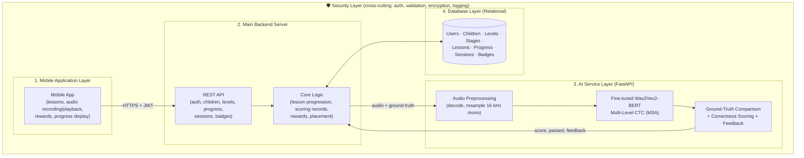

---

### 2. Component Diagram

**Purpose:** Shows internal modules of each layer and their interfaces, mapped to the actual prototype code.

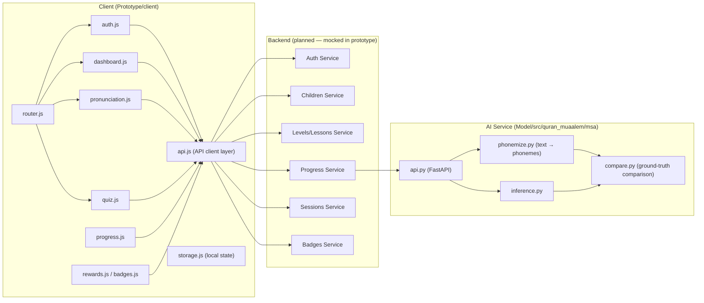

---

### 3. Deployment Diagram

**Purpose:** Shows physical/runtime topology — where each component runs (§11, AI Deployment Strategy: AI service hosted internally or on a controlled server).

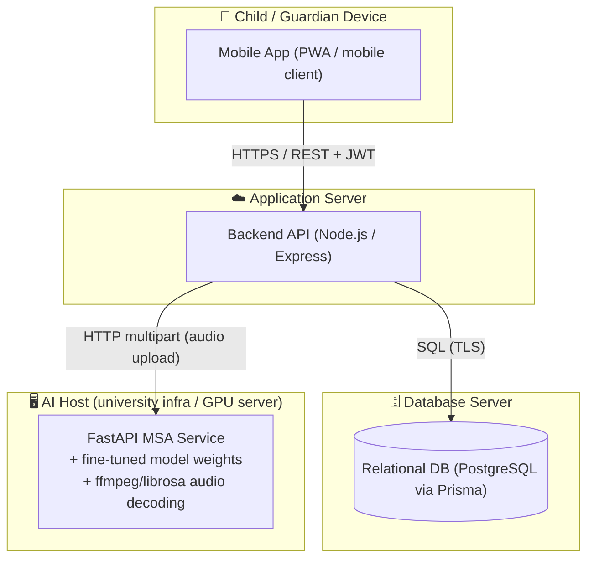

---

## B. Behavioral Diagrams

### 4. Use Case Diagram

**Purpose:** Captures actors (Child, Parent/Guardian, Admin, AI Service) and the MVP use cases from §6, §10, and the prototype pages.

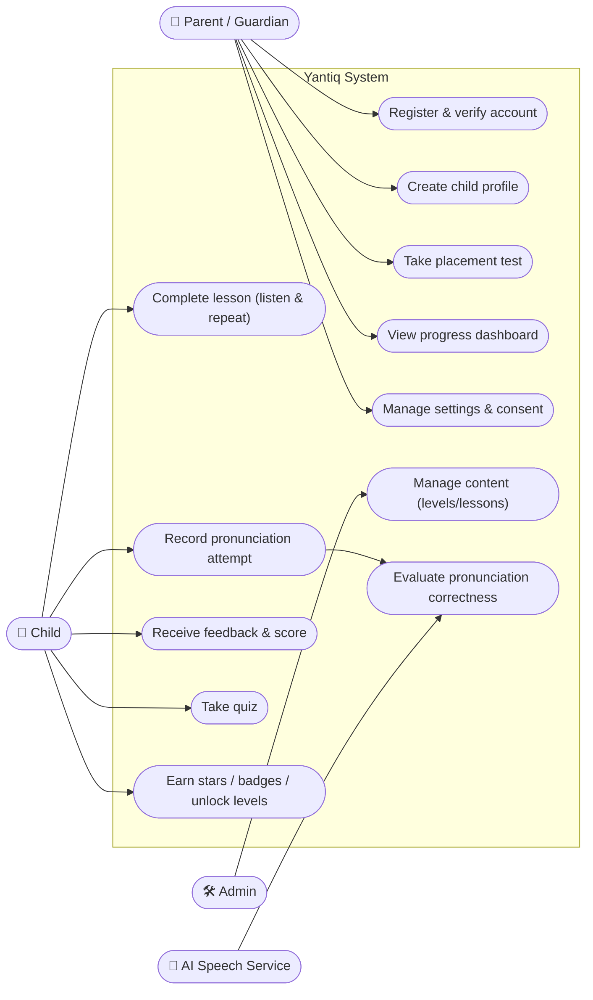

> Note: Mermaid has no native use-case notation; for the final report this can be redrawn in draw.io / PlantUML with proper oval notation.

---

### 5. Entity-Relationship Diagram (ERD)

**Purpose:** Database Layer design (§11.4), derived from `Prototype/shared/types/index.js`.

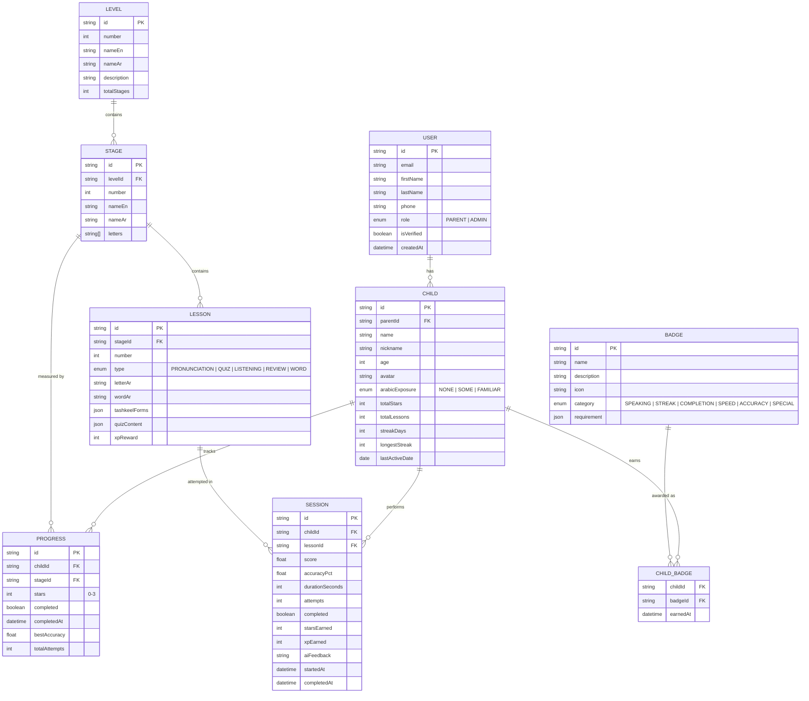

---

### 6. Sequence Diagram — Pronunciation Evaluation

**Purpose:** The core AI interaction (§10, Speaking Interaction Flow). Must demonstrate the ≤ 2 s response-time target end to end.

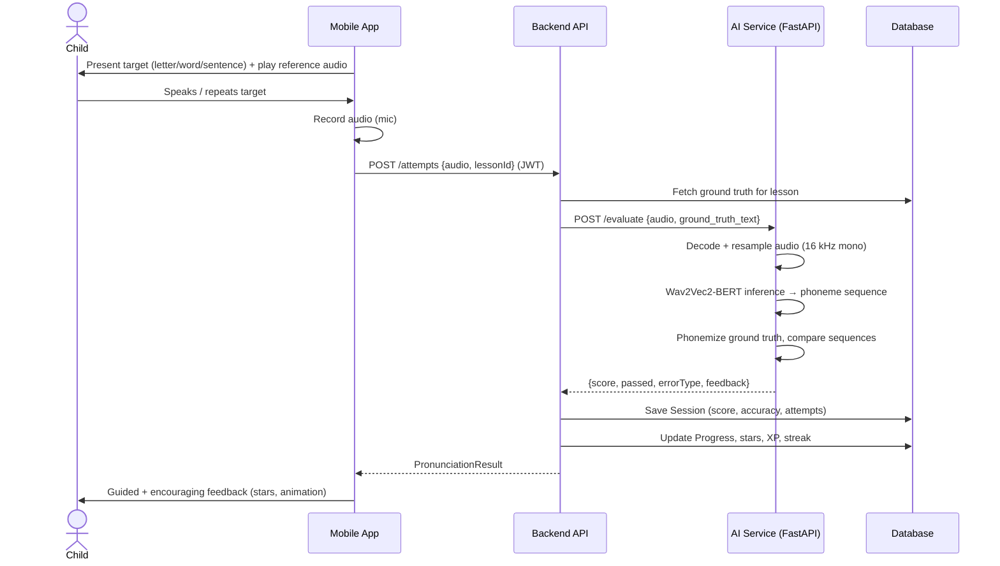

---

### 7. Sequence Diagram — Onboarding & Authentication

**Purpose:** Guardian-driven first-time experience (§10) and the authentication model (guardian account, child profile under it).

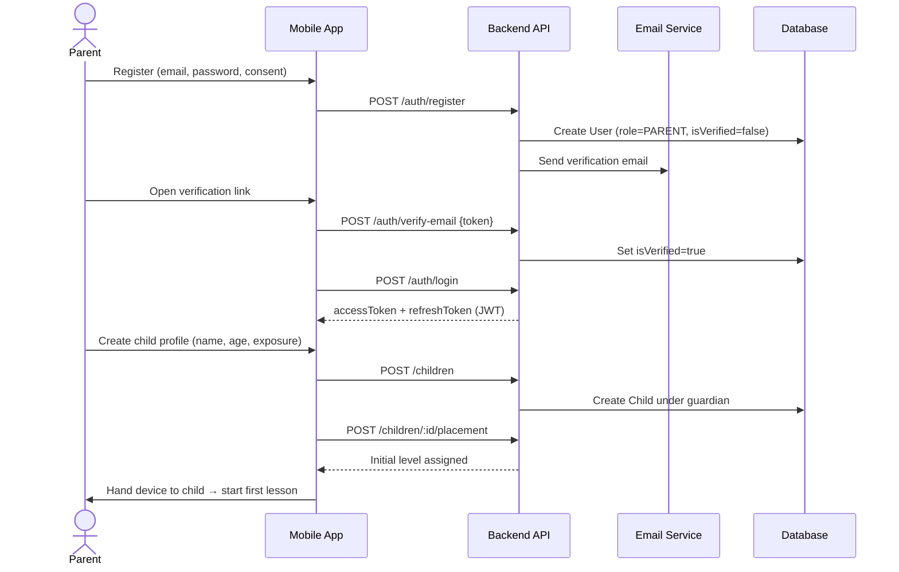

---

### 8. Activity Diagram — Daily Usage Flow

**Purpose:** The §10 Daily Usage Flow: open app → continue lesson → short activity → reward → unlock.

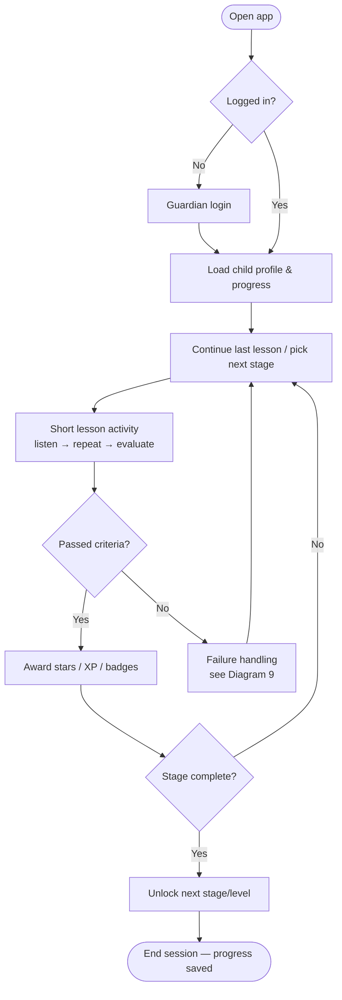

---

### 9. Activity Diagram — Failure Handling & Level Progression

**Purpose:** The hybrid failure approach (§10): first failures → hint + retry; persistent failure → simpler fallback task. Plus must-pass progression.

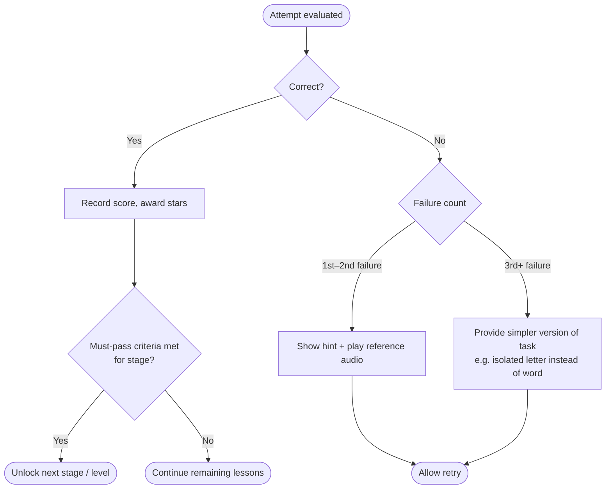

---

### 10. Flowchart — Initial Placement Logic

**Purpose:** §10 Initial Placement Logic: level from age + Arabic exposure, optional placement test.

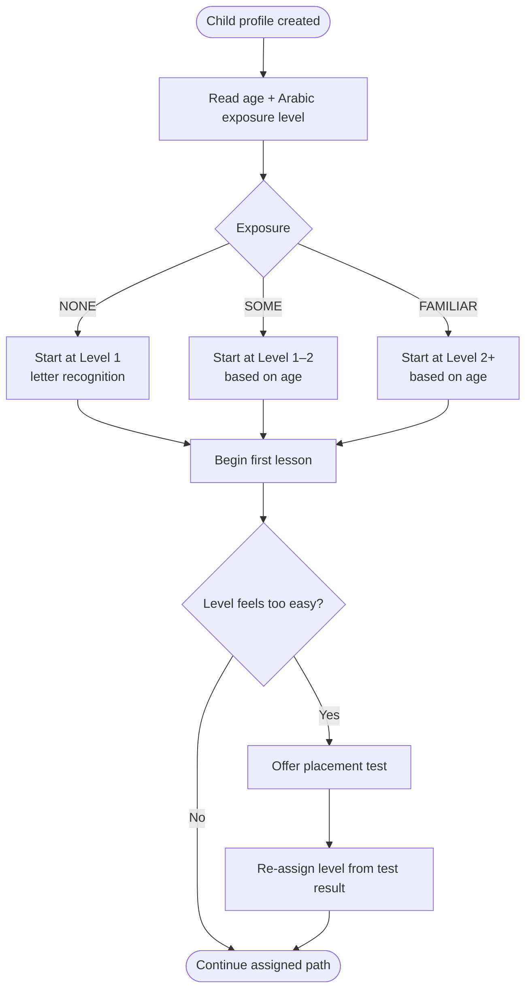

---

### 11. State Diagram — Stage / Lesson Lifecycle

**Purpose:** Models the unlock/progress/completion states that drive gamification and progression.

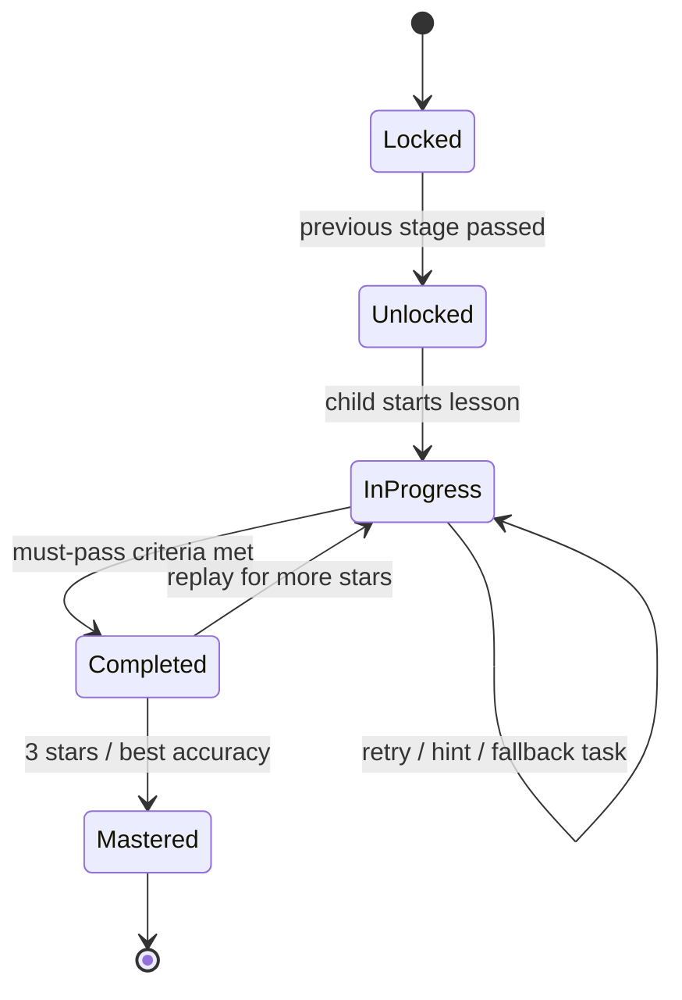

---

## C. Data Diagrams

### 12. Data Flow Diagram (Level 0 & 1)

**Purpose:** Shows how data moves through the system — useful for both the report and the security threat model.

**Level 0 (context):**

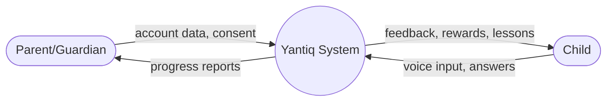

**Level 1:**

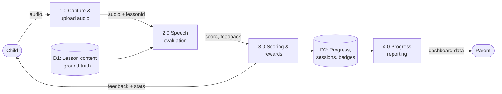

---

## D. AI Diagrams

### 13. AI Model Architecture Diagram

**Purpose:** Required for AI integration documentation (§16.2). Based on `Model/MODEL.md` — Wav2Vec2-BERT encoder with multi-level CTC heads, adapted from Quranic recitation to MSA.

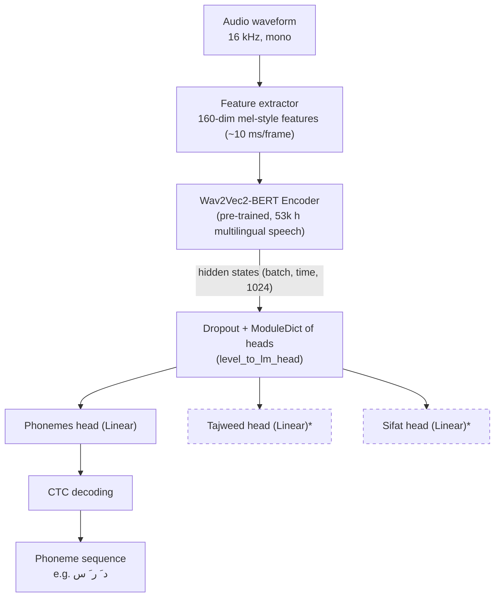

> \* Quranic-specific heads from the base model (`obadx/muaalem-model-v3_2`); the MSA fine-tune focuses on the phoneme level.

---

### 14. AI Inference & Evaluation Pipeline

**Purpose:** End-to-end flow inside the AI Service (`Model/src/quran_muaalem/msa/`): decoding, inference, phonemization, comparison, scoring.

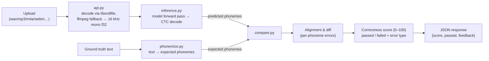

---

## E. Security Diagrams

### 15. Security & Authentication Flow Diagram

**Purpose:** Security deliverable (§16.4) — authentication/authorization design and protection of child data across all layers.

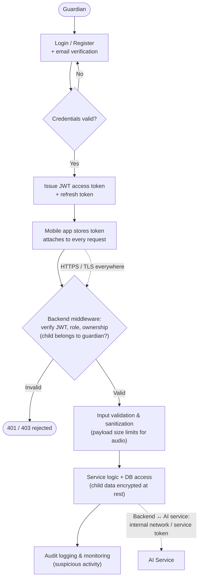

> A companion **threat model diagram** (STRIDE over DFD Level 1, Diagram 12) is part of the security deliverables and can be derived directly from the DFD.

---

## F. Supporting Diagrams

### 16. Class Diagram — Core Domain Model

**Purpose:** Object-oriented view of the backend domain (complements the ERD), from `shared/types/index.js`.

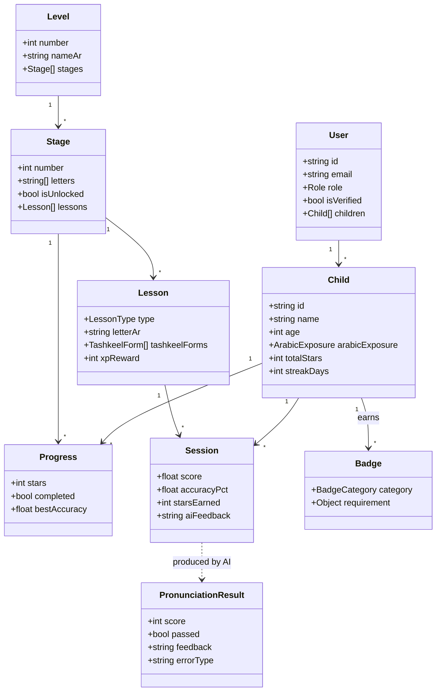

---

### 17. Screen Navigation Map (UI Flow)

**Purpose:** UI/UX deliverable mapping all prototype screens (`Prototype/client/src/pages/`) and their navigation paths.

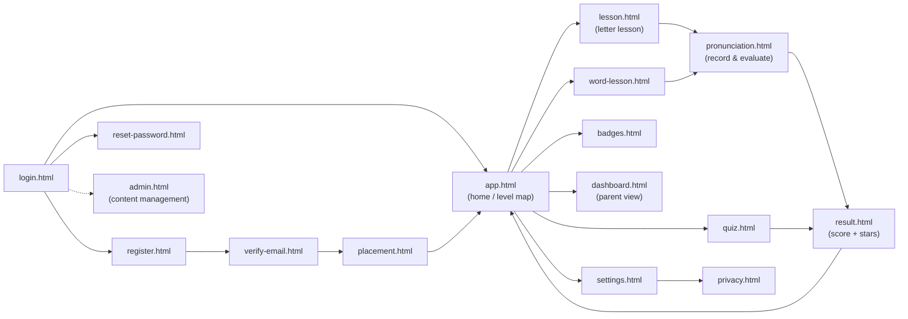

---

## Deliverable Mapping

How these diagrams map to the documentation deliverables in §16 of the project documentation:

| Deliverable (§16) | Diagrams |
|---|---|
| System architecture diagram | 1, 2, 3 |
| API documentation support | 6, 7 (request/response flows) |
| AI integration documentation | 13, 14, 6 |
| Authentication & authorization design | 15, 7 |
| Basic threat model | 12 (DFD as STRIDE basis), 15 |
| Database design | 5, 16 |
| User testing / UX documentation | 17, 8, 9, 10 |
| Final presentation | 1, 4, 6, 13 (recommended core set) |

---

*Generated from: `Yantiq Documentation.md` (V2.6), `Prototype/` (client pages, shared types, mock API), and `Model/` (MODEL.md, MSA service code). Diagrams are Mermaid drafts — refine in draw.io / PlantUML for the final report where formal UML notation is required.*