# Yantiq — Software Diagrams (V2.0)

This document lists **all software diagrams** required for the Yantiq graduation project.

It is derived from [`../phase-0-baseline.md`](../phase-0-baseline.md), which is the
authoritative technical baseline. Section references below (§) point into that document.
Where a diagram and the baseline disagree, the baseline wins and the diagram is a bug.

Each diagram includes its purpose, what it must show, and a Mermaid draft that can be
refined into a final deliverable.

> **What changed from V1.0.** V1.0 was drawn from the V2.6 project documentation and the
> UI prototype, both of which predate the baseline. Three errors ran through most of its
> diagrams and are corrected throughout V2.0:
>
> 1. **Stack.** Node.js/Express, Prisma, and PWA framing are replaced by FastAPI,
>    SQLAlchemy + Alembic, and Expo React Native. The admin portal, Firebase
>    Authentication, and Tailscale now appear as first-class nodes.
> 2. **Authentication.** The backend does not issue login tokens. Firebase authenticates
>    the guardian; the backend *verifies* the resulting Firebase ID token (§6.1).
> 3. **Responsibility split.** The AI service returns evaluation data only. `passed`,
>    thresholds, stars, progression, and child-facing wording belong to the backend (§9.1).
>
> The curriculum is also four levels, not five, and the hierarchy now carries an
> **Exercise** tier: `Level → Stage → Lesson → Exercise` (§3).

---

## Diagram Index

| # | Diagram | Type | Category | Status |
|---|---------|------|----------|--------|
| 1 | [System Architecture Diagram](#1-system-architecture-diagram) | Architecture | Structural | Draft below |
| 2 | [Component Diagram](#2-component-diagram) | UML Component | Structural | Draft below |
| 3 | [Deployment Diagram](#3-deployment-diagram) | UML Deployment | Structural | Draft below |
| 4 | [Use Case Diagram](#4-use-case-diagram) | UML Use Case | Behavioral | Draft below |
| 5 | [Entity-Relationship Diagram (ERD)](#5-entity-relationship-diagram-erd) | ERD | Data | Draft below |
| 6 | [Sequence Diagram — Pronunciation Evaluation](#6-sequence-diagram--pronunciation-evaluation) | UML Sequence | Behavioral | Draft below |
| 7 | [Sequence Diagram — Onboarding & Authentication](#7-sequence-diagram--onboarding--authentication) | UML Sequence | Behavioral | Draft below |
| 8 | [Activity Diagram — Daily Usage Flow](#8-activity-diagram--daily-usage-flow) | UML Activity | Behavioral | Draft below |
| 9 | [Activity Diagram — Failure Handling & Level Progression](#9-activity-diagram--failure-handling--level-progression) | UML Activity | Behavioral | Draft below |
| 10 | [Flowchart — Initial Placement Logic](#10-flowchart--initial-placement-logic) | Flowchart | Behavioral | Draft below |
| 11 | [State Diagram — Exercise / Lesson / Stage Lifecycle](#11-state-diagram--exercise--lesson--stage-lifecycle) | UML State Machine | Behavioral | Draft below |
| 12 | [Data Flow Diagram (Level 0 & 1)](#12-data-flow-diagram-level-0--1) | DFD | Data | Draft below |
| 13 | [AI Model Architecture Diagram](#13-ai-model-architecture-diagram) | Architecture | AI | Draft below |
| 14 | [AI Inference & Evaluation Pipeline](#14-ai-inference--evaluation-pipeline) | Pipeline / Flowchart | AI | Draft below |
| 15 | [Security & Authentication Flow Diagram](#15-security--authentication-flow-diagram) | Flowchart | Security | Draft below |
| 16 | [Class Diagram — Core Domain Model](#16-class-diagram--core-domain-model) | UML Class | Structural | Draft below |
| 17 | [Screen Navigation Map (UI Flow)](#17-screen-navigation-map-ui-flow) | Navigation / Sitemap | UI/UX | Draft below |

---

## A. Structural / Architecture Diagrams

### 1. System Architecture Diagram

**Purpose:** Required documentation deliverable. Shows the service boundaries defined in
§4.1: two clients, one application backend, a separate AI service, PostgreSQL, Firebase
Authentication, and the cross-cutting security layer.

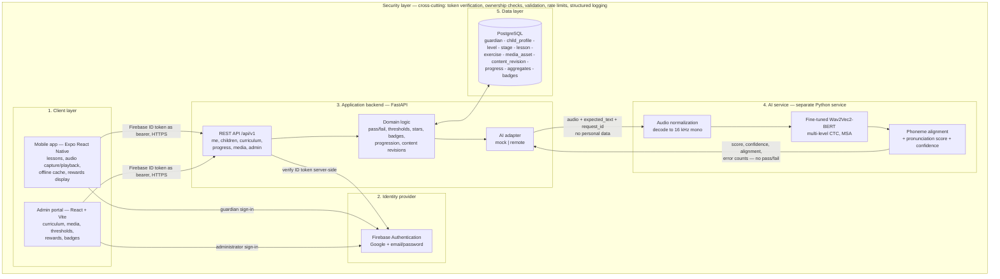

> **Read the two labelled edges carefully — they are what V1.0 got wrong.** The client
> sends a *Firebase ID token*, not a backend-issued JWT (§6.1). The AI service returns
> evaluation data *without* `passed`; the backend derives it (§9.1, §9.3).

---

### 2. Component Diagram

**Purpose:** Internal modules of each component and the interfaces between them.

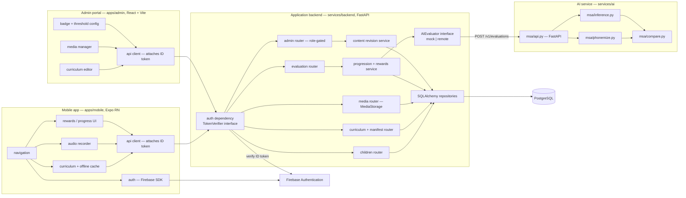

> `TokenVerifier`, `MediaStorage`, and `AIEvaluator` are the three provider-neutral
> interfaces required by §5.3 and §14.2. They exist so that Firebase, PostgreSQL-backed
> media, and the AI service can each be replaced without touching curriculum or progress
> logic.

---

### 3. Deployment Diagram

**Purpose:** Runtime topology — where each component actually runs during Home Lab
testing (§14.1).

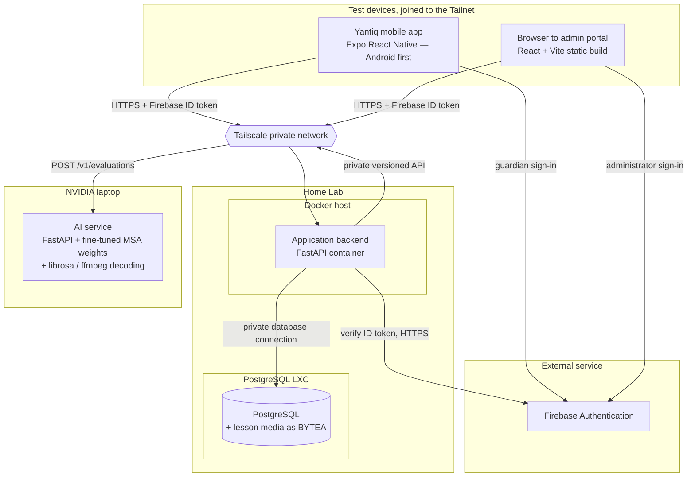

> Neither PostgreSQL nor the AI service is publicly exposed (§13). During development the
> backend runs with `AI_PROVIDER=mock` and the NVIDIA-laptop node is simply absent —
> nothing else in the topology changes (§9.6).
>
> The same images can later move to AWS or Google Cloud, and Firebase Authentication can
> stay in use regardless of where application hosting ends up (§14.2).

---

## B. Behavioral Diagrams

### 4. Use Case Diagram

**Purpose:** Captures the actors (Child, Guardian, Administrator, AI Service) and the MVP
use cases from §2.2, §11, and §12.

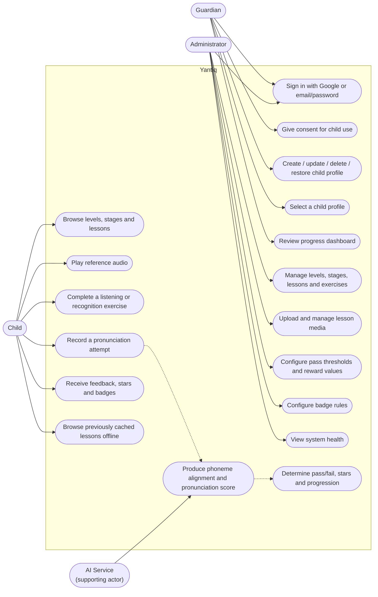

> **UC17 vs UC18 is the point of this diagram.** The AI service produces the measurement;
> the backend makes the judgement (§9.1). V1.0 gave "evaluate pronunciation correctness"
> to the AI actor, which is exactly the mistake the baseline forbids.
>
> Children have no accounts of their own — every child use case is authorized against the
> signed-in guardian's ownership of that profile (§6.2).

---

### 5. Entity-Relationship Diagram (ERD)

**Purpose:** Database design, built directly from the entity list in §7.1 and the
retention rules in §7.2.

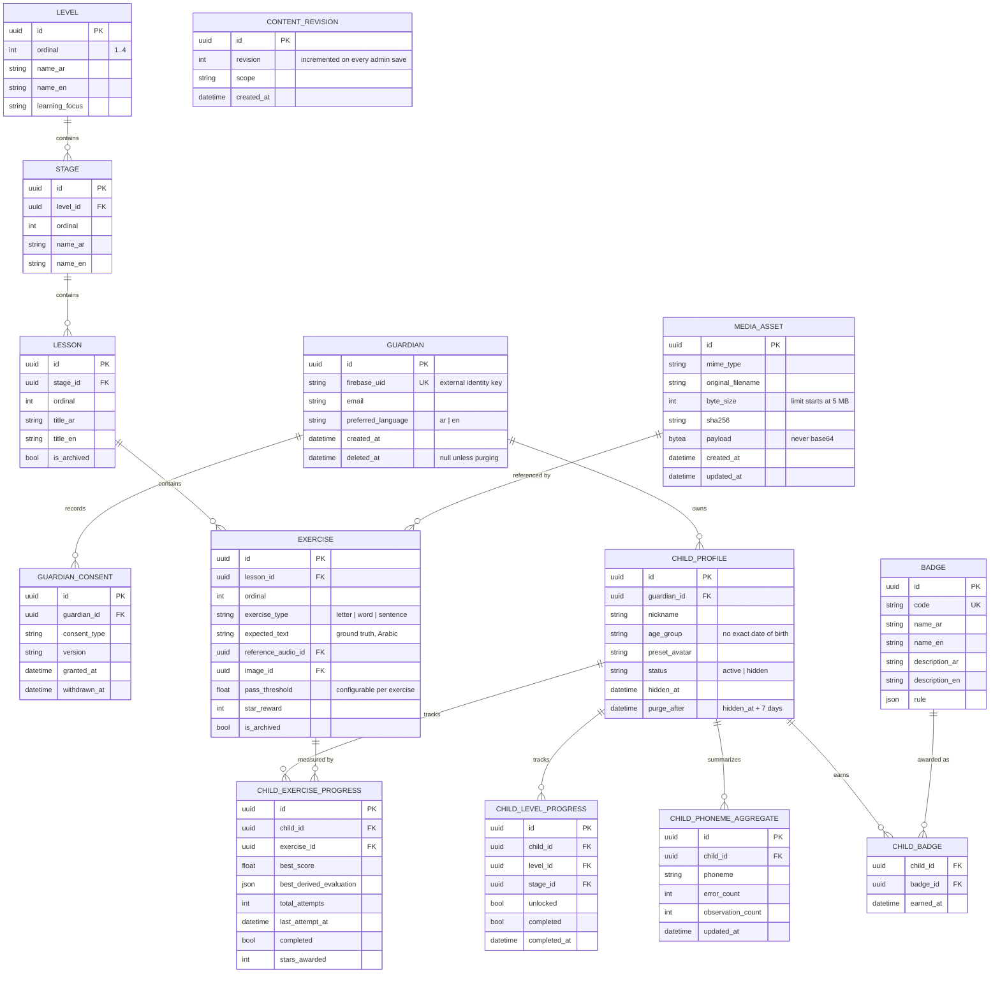

> **There is deliberately no attempt-history table.** §7.2 retains only the best score,
> the best derived evaluation, the attempt count, the last-attempt timestamp, completion
> state, stars, and phoneme aggregates. Once a new result has been compared against the
> stored best and the aggregates updated, the individual result is discarded and the raw
> audio is deleted.
>
> Also deliberately absent: `streakDays` / `longestStreak` (streak pressure mechanics are
> deferred by §2.3), and any exact date of birth or child photograph (§6.2).
>
> `CONTENT_REVISION` stands alone rather than joining to a parent — it is the
> monotonically increasing counter mobile clients compare against to decide whether to
> resynchronize (§8.2).

---

### 6. Sequence Diagram — Pronunciation Evaluation

**Purpose:** The core AI interaction (§9). This diagram is where the responsibility split
has to be unambiguous.

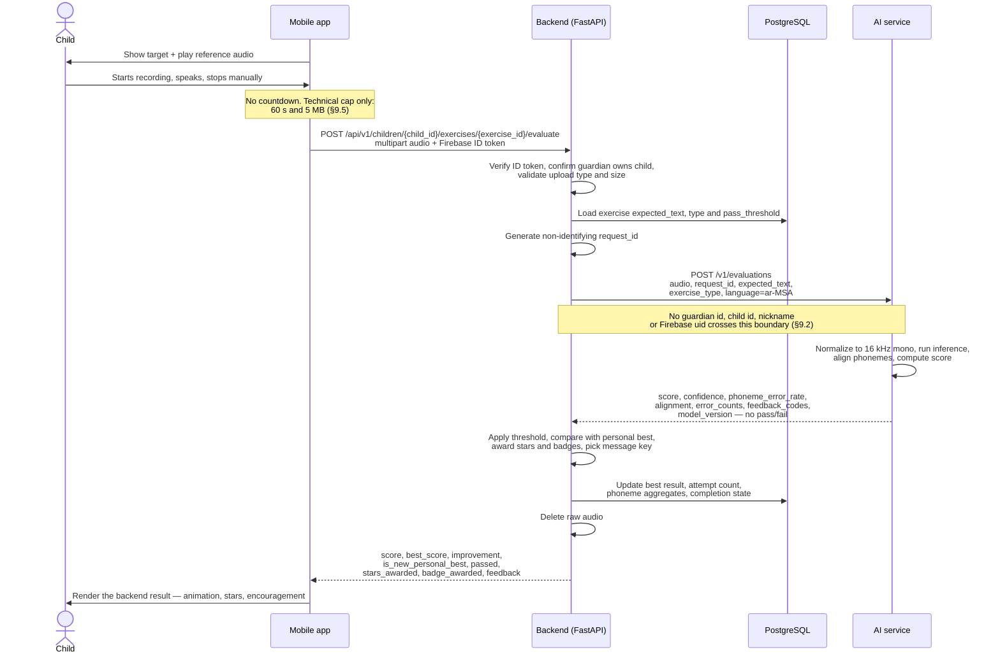

**Failure path (§9.5):** the backend-to-AI timeout is 15 s initially. On timeout or error
the audio is deleted, nothing is queued on the device or the backend, and the child gets a
friendly retry-later result.

---

### 7. Sequence Diagram — Onboarding & Authentication

**Purpose:** Guardian-driven first-time experience (§6.1, §6.2). **The backend never
issues a login token.**

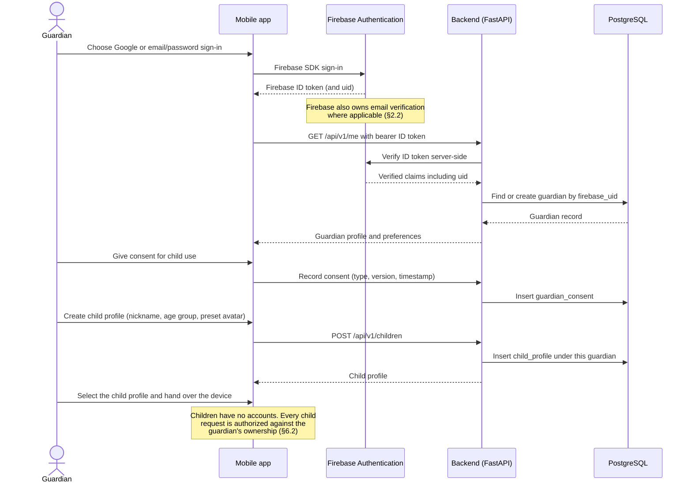

> Administrators use the **same** Firebase project. The backend grants admin access only
> to a privately provisioned UID/role, and re-checks that role on every `/api/v1/admin/...`
> request. A client-side admin screen is not an authorization control (§6.3).

---

### 8. Activity Diagram — Daily Usage Flow

**Purpose:** The daily loop: open app → continue lesson → exercise → reward → unlock.

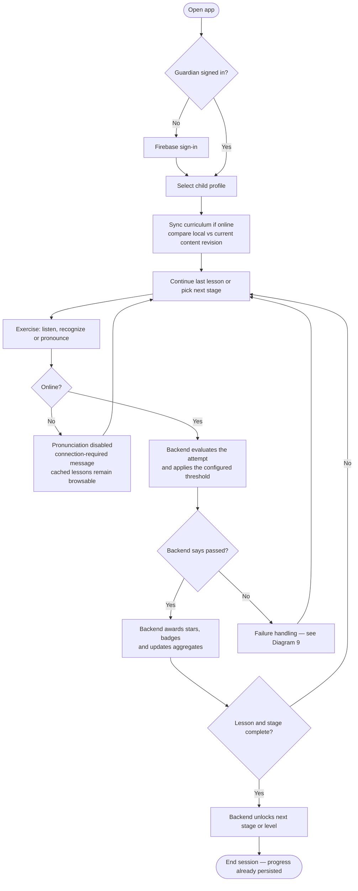

> Every decision diamond here is evaluated **server-side**. The app renders outcomes; it
> does not compute them (§9.1).

---

### 9. Activity Diagram — Failure Handling & Level Progression

**Purpose:** The encouragement-first failure approach (§12) and rule-based progression.

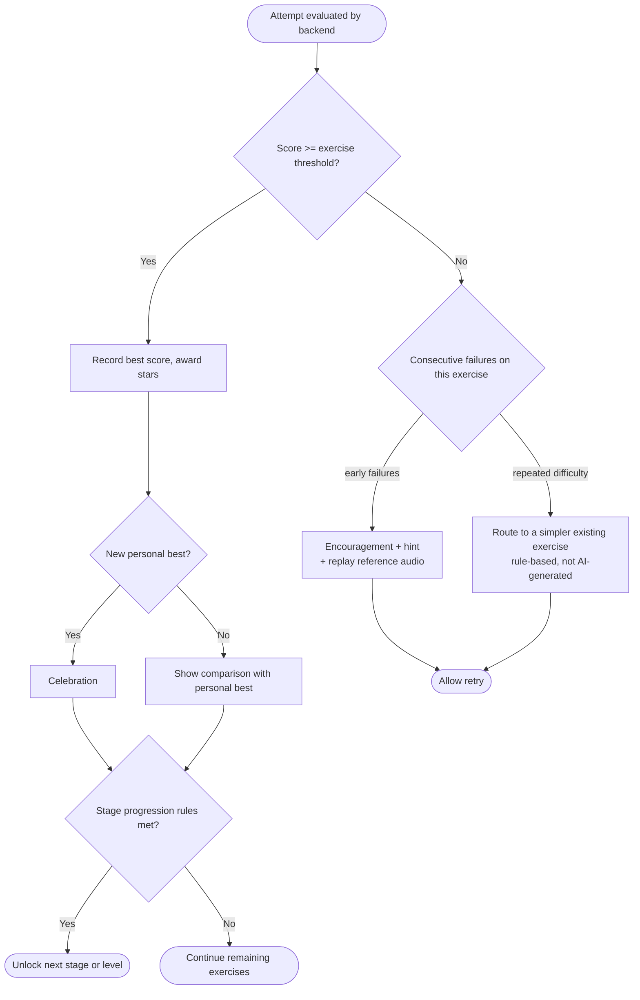

> Two constraints from the baseline: the simpler fallback is **selected from the existing
> curriculum by a rule**, not generated by the AI (§12); and a later threshold change never
> un-completes an already-completed lesson — it applies only to future attempts (§3).

---

### 10. Flowchart — Initial Placement Logic

**Purpose:** Choosing a child's starting point in the four-level curriculum.

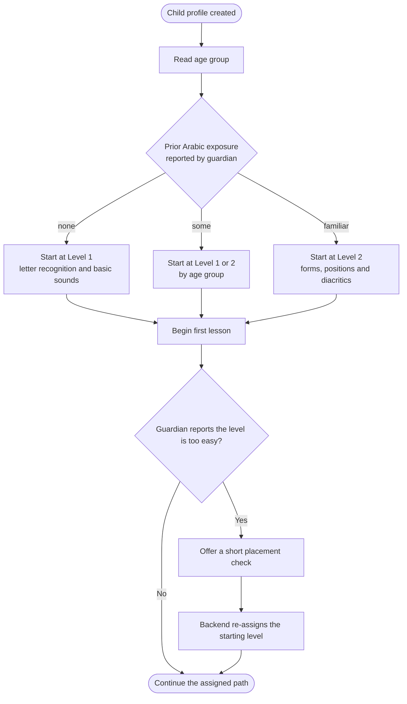

> Placement never skips past Level 2 — Levels 3 and 4 (words, then short sentences) are
> reached through progression, not assignment (§3).

---

### 11. State Diagram — Exercise / Lesson / Stage Lifecycle

**Purpose:** The unlock and completion states that drive gamification and progression.
V1.0 modelled only stage and lesson; the Exercise tier needs its own lifecycle.

**Exercise:**

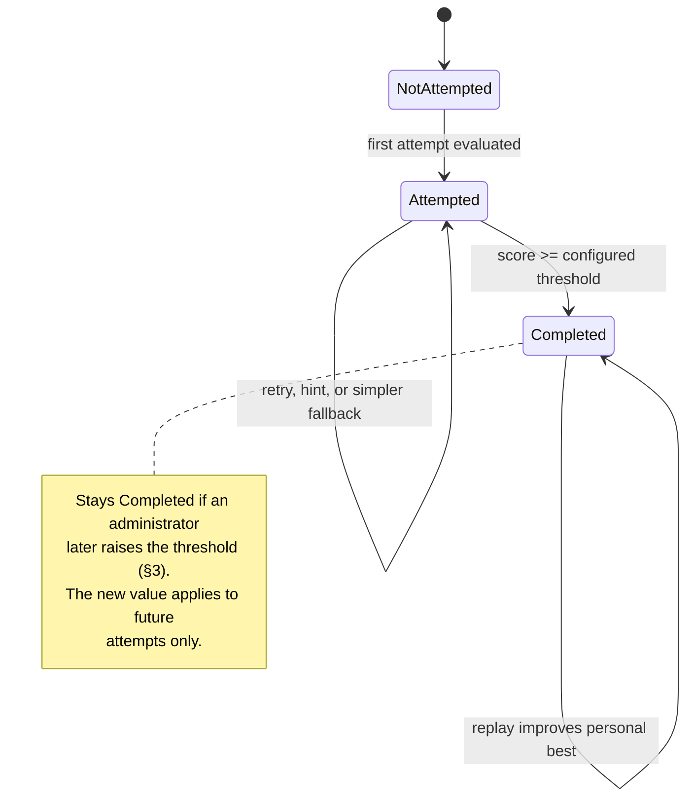

**Lesson and stage:**

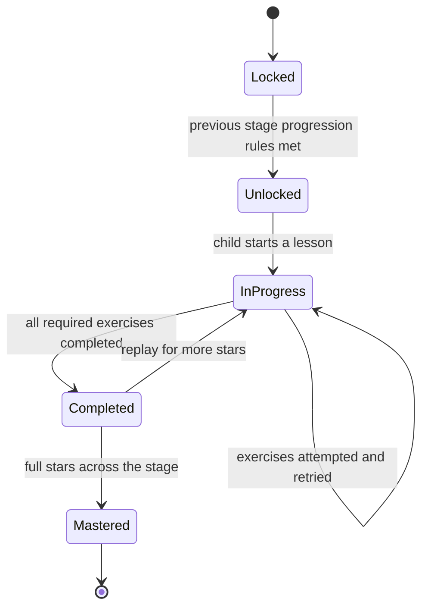

---

## C. Data Diagrams

### 12. Data Flow Diagram (Level 0 & 1)

**Purpose:** How data moves through the system — the basis for both the report and the
STRIDE threat model.

**Level 0 (context):**

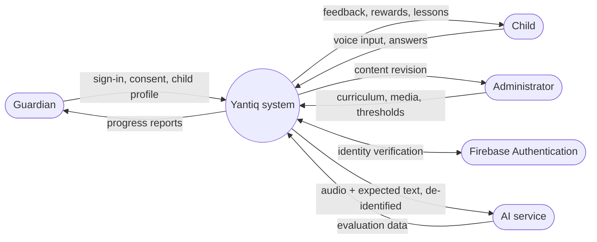

**Level 1:**

```mermaid
flowchart LR
    CHILD(["Child"]) -- "audio" --> P1["1.0 Capture and<br/>upload audio"]
    FBE(["Firebase Authentication"]) -- "verified uid" --> P0["0.0 Verify token and<br/>check ownership"]
    P1 --> P0
    P0 -- "audio + exercise_id" --> P2["2.0 Request evaluation"]
    GT[("D1: Curriculum<br/>levels, stages, lessons,<br/>exercises, expected text,<br/>thresholds, media")] --> P2
    P2 -- "audio + expected_text<br/>+ request_id only" --> AISVC(["AI service"])
    AISVC -- "score, alignment,<br/>error counts" --> P3["3.0 Apply thresholds,<br/>stars and progression"]
    GT --> P3
    P3 --> PR[("D2: Progress, aggregates,<br/>badges — best result only")]
    P3 -- "feedback + stars" --> CHILD
    P3 -- "delete raw audio" --> X["audio discarded"]
    PR --> P4["4.0 Progress reporting"]
    P4 -- "dashboard data" --> PARENT(["Guardian"])
    ADMINA(["Administrator"]) --> P5["5.0 Author content"]
    P5 --> GT
    P5 --> REV[("D3: Content revision")]
    REV --> P6["6.0 Publish manifest"]
    P6 -- "manifest + checksums" --> CHILD
```

> Two trust boundaries matter for the threat model: **P0** (nothing proceeds without a
> verified Firebase uid and a confirmed guardian-owns-child check) and the **P2 → AI
> service** edge (de-identified payload only, and the audio is destroyed on both sides once
> evaluation finishes).

---

## D. AI Diagrams

### 13. AI Model Architecture Diagram

**Purpose:** Required for AI integration documentation. Based on
[`../../services/ai/MODEL.md`](../../services/ai/MODEL.md) — a Wav2Vec2-BERT encoder with
multi-level CTC heads, adapted from Quranic recitation to MSA.

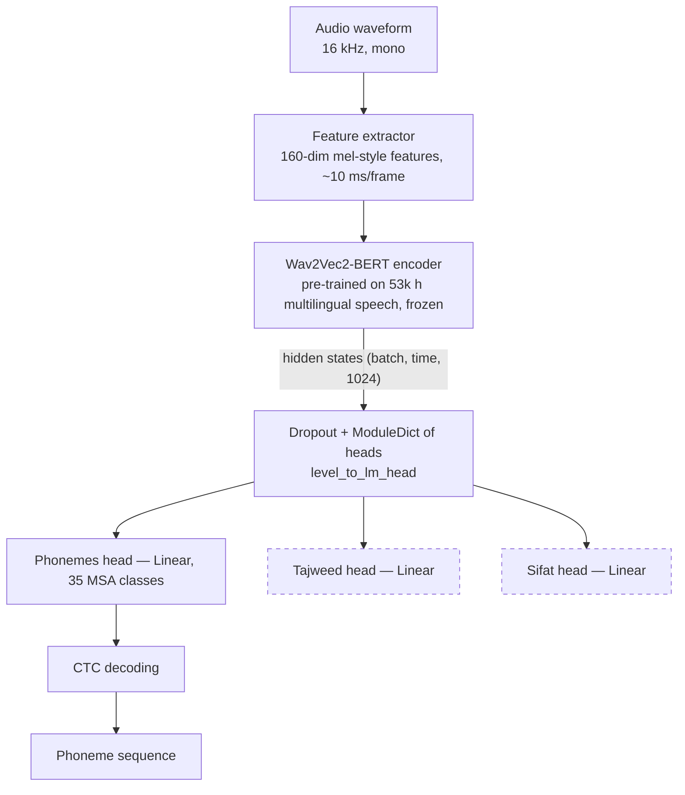

> Dashed heads are Quranic-specific heads inherited from the base model
> (`obadx/muaalem-model-v3_2`); the MSA fine-tune resizes and trains the phoneme head only
> (43 → 35 classes) and keeps the encoder frozen.
>
> **Scope caveat from §5.4:** Quranic recitation data may support pretraining or
> augmentation, but Modern Standard Arabic is the product domain, and Quranic-recitation
> validation alone is not sufficient to claim child-MSA performance (§16.2).

---

### 14. AI Inference & Evaluation Pipeline

**Purpose:** The end-to-end flow inside the AI service
([`../../services/ai/src/quran_muaalem/msa/`](../../services/ai/src/quran_muaalem/msa/)).

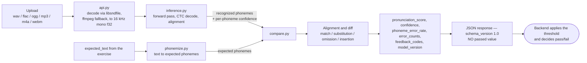

> **Implementation gap, stated honestly.** The service today exposes `/health`,
> `/transcribe`, `/align`, `/compare` and `/debug`. `/compare` already produces the
> alignment, edit operations, counts and phoneme error rate; it does **not** yet produce
> `pronunciation_score`, `confidence`, `model_version` or `feedback_codes`, and there is no
> `/v1/evaluations` route. Closing that gap is Phase 5 work — see
> [`../../contracts/ai-api/README.md`](../../contracts/ai-api/README.md).

---

## E. Security Diagrams

### 15. Security & Authentication Flow Diagram

**Purpose:** Security deliverable — authentication, authorization, and protection of child
data across all layers (§13).

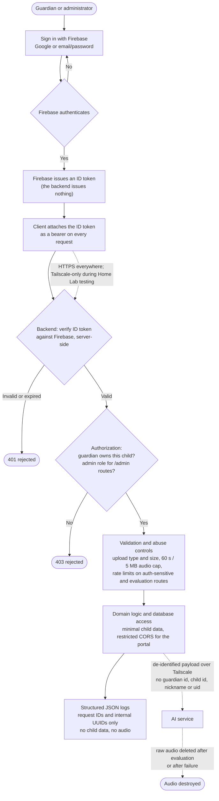

> A companion **STRIDE threat model** over DFD Level 1 (Diagram 12) is part of the security
> deliverables and derives directly from that diagram's two trust boundaries.
>
> Deletion is also a security control: a deleted child profile is hidden immediately, then
> permanently purged with its dependent progress and reward data after seven days (§7.3).

---

## F. Supporting Diagrams

### 16. Class Diagram — Core Domain Model

**Purpose:** Object-oriented view of the backend domain, complementing the ERD.

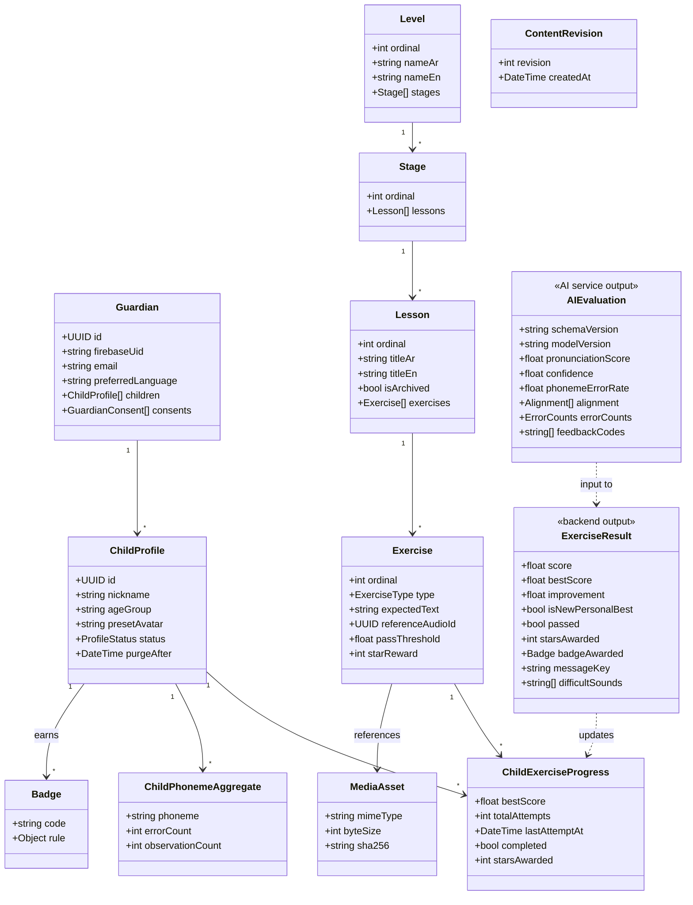

> **`AIEvaluation` and `ExerciseResult` are two different classes on purpose.** The AI
> service produces the first; the backend combines it with the exercise threshold and the
> stored personal best to produce the second (§9.3, §9.4). V1.0 collapsed both into a single
> `PronunciationResult` carrying `passed` and a human-readable `feedback` string "produced
> by AI" — that class does not exist in this design.
>
> `messageKey` is a translation key, not a sentence: child-facing wording is chosen by the
> backend and localized by the client.

---

### 17. Screen Navigation Map (UI Flow)

**Purpose:** UI/UX deliverable. Two separate applications, two separate maps.

**Mobile app (`apps/mobile`):**

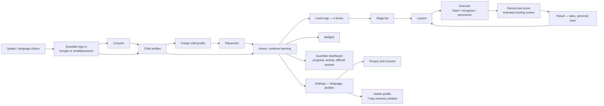

**Admin portal (`apps/admin`) — a separate application, not a screen inside the mobile app:**

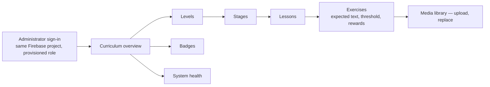

> Every screen is built and tested in both Arabic and English, with RTL and LTR layouts,
> on phone and tablet breakpoints (§5.1, §16.3).

---

## Deliverable Mapping

| Deliverable | Diagrams |
|---|---|
| System architecture diagram | 1, 2, 3 |
| API documentation support | 6, 7 (request/response flows) |
| AI integration documentation | 13, 14, 6 |
| Authentication and authorization design | 15, 7 |
| Basic threat model | 12 (DFD as STRIDE basis), 15 |
| Database design | 5, 16 |
| User testing and UX documentation | 17, 8, 9, 10 |
| Final presentation | 1, 4, 6, 13 (recommended core set) |

---

*Derived from [`../phase-0-baseline.md`](../phase-0-baseline.md) and the AI service code in
`services/ai/`. Diagrams are Mermaid drafts — refine in draw.io or PlantUML for the final
report where formal UML notation is required.*
