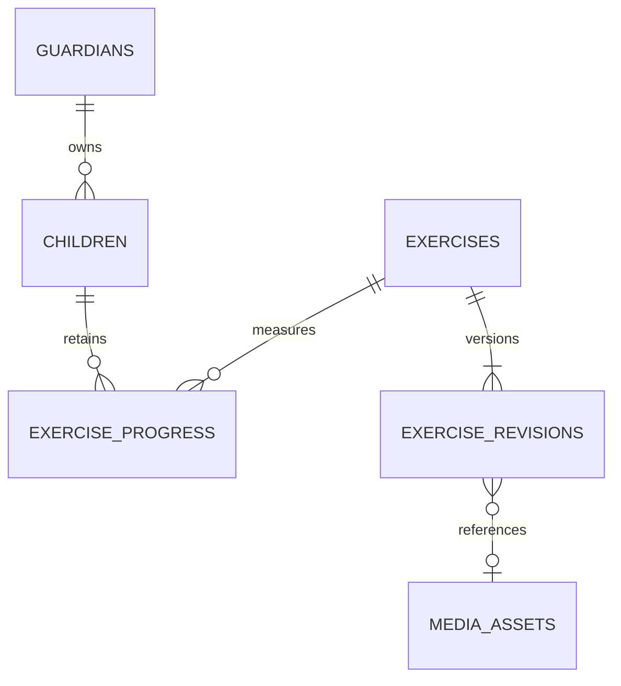

# PostgreSQL design and data lifecycle

## Scope

Reference DDL: [reference-schema.sql](reference-schema.sql). This is a proposed schema, not executed migrations. It uses PostgreSQL UUID, TIMESTAMPTZ, BYTEA and JSONB. Map into SQLAlchemy models and Alembic; validate on the actual installed PostgreSQL major version in a disposable database. Schema changes use expand/contract migrations compatible with rollback images.

IDs are application-generated UUIDs. API times use RFC3339 UTC; DB times are timezone-aware. Scores have a 0–100 range, not probability semantics. Store full numeric AI precision in JSONB; the proposed threshold has two decimal places, which the implementation should validate before DB insertion rather than silently round user input.

## Entity map

This diagram shows core result ownership only. The complete hierarchy and lifecycle tables are mapped below; exercise revisions have separate optional image and reference-audio foreign keys.

| Table | Identity / relationships | Responsibility |
| --- | --- | --- |
| guardians | id; unique firebase_uid | External identity mapping and server-held role |
| guardian_consents | guardian + policy version unique | Timestamped processing consent; not research audio permission |
| avatars | stable string ID | Preset avatar metadata; assets bundled with apps |
| children | guardian FK | Nickname, age band, avatar and deletion lifecycle |
| levels/stages/lessons | ordered parent FKs | Exactly four seeded levels; learning hierarchy |
| exercises | lesson FK; current revision FK | Stable progression identity, order and current publication |
| exercise_revisions | exercise FK; assessment_key | Immutable evaluation text/type/threshold and presentation snapshot |
| catalog_state | one row | Atomic cache invalidation version |
| media_assets | creator FK; BYTEA | Persistent reference media, never child recordings |
| exercise_progress | child + exercise primary key | One best evidence JSON, completion, stars and aggregate attempt count |
| lesson_progress | child + lesson primary key | Durable completion; absence means not completed |
| daily_activity | child + UTC day primary key | Counts only; not a score timeline |
| phoneme_aggregates | child/exercise/assessment/scoring/phoneme | Error/opportunity totals without individual results |
| badge_definitions/child_badges | badge ID; child + badge unique | Fixed rule definitions and idempotent awards |
| evaluation_receipts | guardian + key unique | Short-lived concurrency/idempotency metadata, no result body |
| admin_audit_events | actor FK | Curriculum change metadata only |
| child_deletion_tombstones | deleted child UUID, no FK | Prevent resurrection during backup recovery |

There is deliberately no attempts table storing every evaluation. The current losing result exists only in processing memory and the immediate response; best_evidence is replaced atomically on a genuine improvement or a new comparable context.

## API field mapping

| API field | Persistence / derivation |
| --- | --- |
| Guardian.consent_version | Latest accepted current policy in guardian_consents |
| Guardian.required_consent_version / consent_required | Current versioned backend policy configuration / absence of matching guardian consent |
| Localized.ar / .en | Corresponding title_ar/title_en or instructions_ar/instructions_en |
| Exercise.revision_id | exercises.current_revision_id |
| Exercise.assessment_key | current exercise_revisions.assessment_key |
| Exercise.type / expected_text / pass_score / media IDs | Current revision columns |
| Exercise.active / required / lesson_id / position | exercises columns |
| Progress.completed | completed_at IS NOT NULL |
| Progress.best.evidence | exercise_progress.best_evidence |
| Progress.best.exercise_revision_id | best_revision_id |
| Progress.best.evaluated_at | best_evaluated_at |
| Dashboard.attempt_count | Sum exercise_progress.attempt_count |
| Dashboard.activity | daily_activity, last 30 UTC days by default |
| Dashboard.difficult_sounds | Sum eligible aggregate errors/opportunities; omit zero opportunities |
| Media.sha256 / byte_length | Digest/length of raw payload, not Base64 text |
| Catalog.version / HTTP ETag | catalog_state.version / quoted representation |

Backend validates the entire EvaluationEvidence JSON before persistence; PostgreSQL JSONB alone does not enforce the OpenAPI structure. Generated columns support comparisons without duplicate manually maintained score fields.

## Integrity and transaction rules

Create an exercise and its initial revision in one transaction; both UUIDs are allocated beforehand. Deferred composite FKs ensure a current revision belongs to the same exercise. Four level rows are seeded once; SQL position range/uniqueness limits them to four, while tests and startup checks enforce all four exist. Admin cannot create/delete a level.

Foreign keys enforce ownership of references, not authorization. Every child query is scoped to verified guardian ID and deletion state. Access checks occur in the service/repository layer; optional PostgreSQL RLS is later defense in depth, not a replacement for these checks.

Admin create/update locks the relevant row, checks ETag, creates an immutable revision where needed, updates current pointer and bumps catalog_state.version together. Reordering siblings uses deferred uniqueness within a transaction. Do not hard-delete referenced curriculum in v1: set active=false.

Media kind must match each reference field (image versus reference_audio), MIME signature must match content and referenced assets must exist. These cross-table semantic checks belong to the application transaction. Current and retained revision FKs prevent accidental deletion of referenced media.

## Best, completion and revisions

Compare only when exercise assessment_key AND AI scoring_version AND mode match. AI must bump scoring_version whenever model changes alter comparability; model_version alone is provenance. On incompatible context, old best is replaced, previous_best is null, comparison=new_context and delta is null. On a target edit, old best is no longer displayed as a result for current content; clear incompatible best fields/phoneme aggregates transactionally with the edit. Retain completion, stars, attempt counts and daily counts.

Threshold-only edits retain assessment_key and best. No retroactive completion revocation, reward reduction or automatic pass caused solely by lowering a threshold. Future valid attempts use the revision pinned at their start. A stored best may therefore be above the new threshold while an exercise is not yet completed; do not silently backfill completion.

For in-flight evaluation on a revision superseded during inference: return its evidence and pinned threshold result, but only commit progress if current assessment_key is still the same. If target changed, fail finalization with STALE_EXERCISE (409), discard evidence/audio, do not increment counters. Presentation/threshold-only changes can finalize against the pinned snapshot. This rule prevents an old target from replacing current-target best.

Acquire locks in consistent order: child → exercise → exercise_progress → receipt. Admin edits lock exercise but never wait for child rows while holding that lock; invalidate best rows through a transaction strategy reviewed for deadlock safety (see below). Completion and reward writes belong in the same successful scoring transaction.

Avoid admin/scoring lock inversion: do not lock child rows inside an admin edit transaction. Scoring obtains child, then exercise; admin obtains exercise then updates best rows without acquiring children. PostgreSQL FK and update locks still require concurrency tests and bounded transaction retry. If implementation introduces child locking for invalidation, revise the global order first.

## Attempt counters and sound aggregates

Count each successful, schema-valid, still-current evaluation exactly once, including genuine low scores. Do not count timeout, silence, unsupported target, canceled request or stale target. Daily activity stores number of valid evaluations and newly completed lessons. First-completion exercise/lesson timestamps are monotonic.

For each expected phoneme: opportunities += match + substitution + deletion; errors += substitution + deletion. Insertions have a separate inserted_count and do not inflate errors beyond opportunities. Dashboard uses only aggregate rows compatible with current assessment and deployed scoring semantics. Require a reviewed minimum sample before labeling a sound “difficult”; initially show evidence count and neutral “needs practice” wording, not diagnoses.

## Retention

| Data | Proposed retention |
| --- | --- |
| Child audio on mobile/backend/AI | Only capture/transport/evaluation lifetime; delete on every terminal path |
| Immediate losing result | Memory/response only; not stored in logs/receipts/cache |
| Best result and aggregate activity | Until child deletion purge or relevant best invalidation |
| Coordination receipts | 24 hours; expiry sweeper, no scores/audio |
| Soft-deleted child | Hidden immediately; restore before seven-day deadline |
| Purged child and dependent tables | Remove from live DB after seven days |
| Weekly backups | 30 days; encrypted and access-restricted |
| Deletion tombstones | At least beyond the last backup that could contain the child; proposal 37 days after live purge |
| Admin audit | Proposed 90 days; owner review; no child payload |
| Old exercise revisions | Retain while referenced by current content, best result or unexpired receipt; otherwise prune in safe maintenance |

At purge, lock child, finalize/cancel outstanding receipts, record minimal tombstone, delete child cascades, and export tombstone to separate recovery storage before a backup can be promoted as restorable. A restore must reconcile the latest deletion ledger and due soft deletions before enabling app traffic. Ledger updates and restore fencing need an operationally tested process; a SQL table restored with the same old snapshot is insufficient.

## Migration and verification checklist

- Build all migrations on an empty local database, then upgrade a seeded prior schema.
- Exercise circular deferred FKs, generated JSON score columns and sibling reorder constraints.
- Reject malformed evidence before any write; check transaction rollback.
- Test duplicate keys and deletion/edit races with two independent DB connections.
- Verify media bytes and SHA-256 after backup/restore.
- Run EXPLAIN for guardian-child lookup, catalog joins, progress and purge selection.
- Avoid SELECT * against media_assets; use metadata-only projections.
- Do not index every JSON field; add measured indexes only.
- Keep runtime DB user unable to alter schema or provision admin roles through API.
