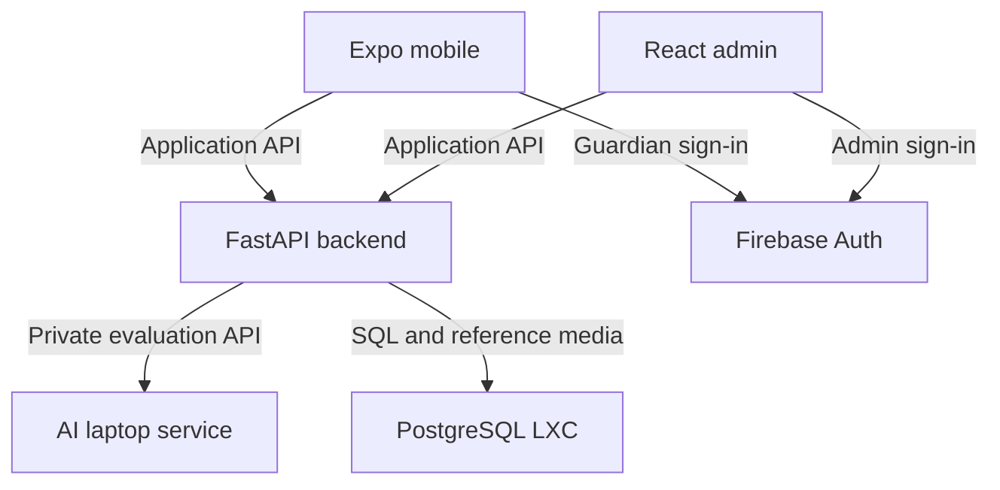

# Architecture and ownership

## Components

Mobile/admin/backend/AI connections use the approved private network; Firebase sign-in uses internet connectivity. Tokens are verified by the backend. Neither client reaches PostgreSQL or AI directly.

| Component | Owns | Must not own |
| --- | --- | --- |
| Mobile | Authentication UX, profile selection, media cache, recorder, result presentation, RTL/LTR | Trusted scores, permissions, thresholds, permanent child audio |
| Admin portal | Curriculum/media editing and operational error presentation | Direct SQL, role grants to itself, score calculation |
| FastAPI backend | Firebase verification, authorization, child data, published curriculum, attempts, completion, rewards, orchestration | Speech model internals or fabricated real evaluation scores |
| AI service | Audio validation/normalization, target phonemes, model inference, scored evidence | Guardian IDs, child IDs, database access, pass score or progression |
| PostgreSQL | Relational state, one best result per exercise, aggregate activity and reference media | Raw recordings or model weights |
| Tailscale | Authorized private network reachability | Replacing application authentication and child ownership checks |

## Network design

Mobile test devices and developer computers join the approved tailnet. The backend and admin origin are private HTTPS endpoints available only to authorized testers. PostgreSQL is accessible only by backend and backup/operator identities. The AI laptop accepts calls only from the backend plus explicit health/maintenance access. Do not publish the AI or database to the public internet.

Use a private HTTPS reverse proxy or Tailscale-supported HTTPS setup, with its actual hostname configured after infrastructure review. Native mobile does not rely on browser CORS; the admin does. Restrict CORS to the exact admin development/release origins. Firebase endpoints still require internet access; “local” means app services/data, not offline authentication.

## Boundaries and identities

Firebase ID token goes to the backend as Bearer authorization. Verify signature, issuer, audience, expiry and project using the Admin SDK; application ownership and role checks remain separate. Provider UID maps uniquely to a PostgreSQL guardian record. Do not use email as the relational ownership key.

Backend-to-AI uses a separate rotated service credential over private TLS. The examples use a Bearer service token, not a Firebase user token. Secret material stays server-side. AI receives an opaque request_id, target text, type, language and recording. Neither nickname nor account/child IDs are transmitted.

## Repository mapping

| Path already scaffolded | Planned responsibility |
| --- | --- |
| apps/mobile | Expo app and mobile feature tests |
| apps/admin | Vite admin portal and browser tests |
| services/backend | FastAPI domain modules, migrations and integration tests |
| services/ai | Existing Python model; v1 adapter, mock and real evaluator implementations |
| contracts/application-api | Proposed application OpenAPI (`openapi.design.json`) and response fixtures |
| contracts/ai-api | AI OpenAPI, fixtures and conformance tests |
| contracts/shared | Integration rules and the comparison scenario manifest |
| contracts/tools | Contract validator and pinned requirements |
| docs | Baseline, ADRs, phase guides, database design, testing, operations and architecture |
| \<component\>/docs | The implementation plan governing that component |
| infra/compose | Development services and Home Lab deployment configuration |
| infra/scripts | Explicit deployment, backup, restore and health scripts |
| prototype-archive | Read-only design inspiration; no dependency on its runtime |

## Interfaces inside the backend

`TokenVerifier.verify(token) -> VerifiedPrincipal`; `MediaStorage.put/get/delete`; `AIEvaluator.evaluate(request) -> EvaluationEvidence`; `Clock.now()` for deterministic retention tests. Domain logic must not import Firebase or HTTP clients directly. Separate adapters make local testing and later hosting migration feasible.

The mock evaluator implements the same interface and contract as real AI. It advertises `mode=mock`. Production startup must reject mock mode unless the deployment is explicitly a demonstration environment; label every simulated result. Never mix simulated best scores with real children’s progress.

## Cross-service sequence

1. User selects a cached or current exercise. Mobile refreshes its revision before enabling an online evaluation.
2. Backend authenticates, checks ownership/consent/deletion, order and current revision.
3. Backend creates a metadata-only idempotency receipt, pins the exercise revision and calls AI.
4. AI returns structured evidence. Backend validates correlation, schema and finite values.
5. One transaction locks child/progress, checks deletion fencing, compares compatible best, updates aggregates, completion and badges.
6. Mobile gets current evidence plus previous_best and authoritative progress. Temporary audio is deleted on every path.
7. Dashboard reads stored best/aggregates; it cannot recreate losing scores.

Failures and publication races are specified in the integration rules, not left to individual client interpretations.
