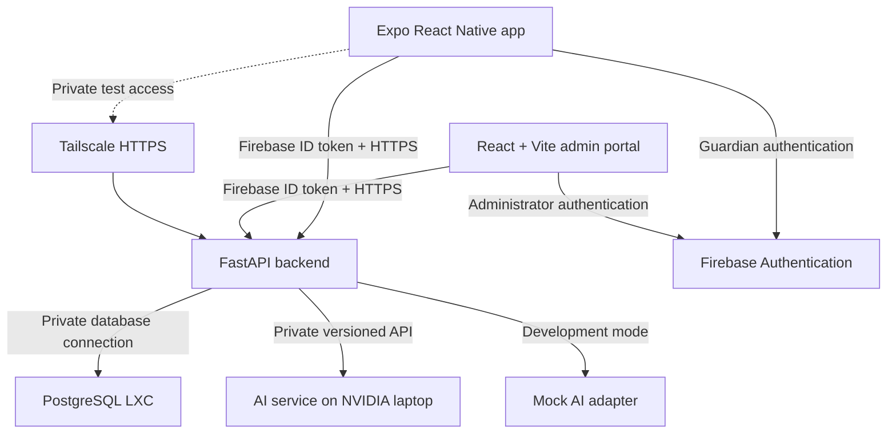

# Yantiq — Phase 0 Technical Baseline and Implementation Roadmap

**Status:** Phase 0 approved baseline  
**Prepared:** 8 September 2026  
**Target:** Working graduation-project delivery by December 2026  
**Repository:** <https://github.com/MohamedMaged9258/Yantiq>

## 1. Purpose

This document is the single technical baseline for implementing Yantiq. It consolidates the decisions made after reviewing the repository documentation, the existing AI service, the `Muaalem-Dataset` branch, and the UI/UX prototype.

Where older documents, diagrams, or prototypes conflict with this baseline, this document takes precedence until those files are updated.

## 2. Product Definition

Yantiq is a bilingual, AI-assisted early Arabic reading tutor for children aged 4–7. It teaches Modern Standard Arabic through a guided progression from letters to words and short sentences. Children listen, repeat, receive encouraging pronunciation feedback, earn stars and badges, and progress through structured lessons. Guardians manage child profiles and review progress.

### 2.1 Primary users

- **Child:** completes lessons and pronunciation exercises.
- **Guardian:** authenticates, creates and selects child profiles, grants consent, and reviews progress.
- **Administrator:** manages curriculum, media, thresholds, badges, and published content through the web portal.

### 2.2 Initial scope

- Guardian registration and login using Google or email/password.
- Guardian email verification where applicable.
- One guardian managing one or more child profiles.
- Child profile selection without a separate child login.
- Guided four-level curriculum.
- Listening, visual learning, and pronunciation exercises.
- Real-time pronunciation evaluation when the AI service is available.
- Mock AI adapter during application development.
- Configurable pass thresholds.
- Stars, badges, encouragement, and personal-best comparison.
- Guardian dashboard showing progress, activity, and difficult-sound aggregates.
- Administrator portal included from the beginning.
- Arabic and English interfaces with RTL/LTR support.
- Android first, followed by iOS.
- Responsive phone and tablet layouts.
- Offline browsing of previously cached lessons; scoring remains online.

### 2.3 Deferred scope

- Multiple guardians sharing the same child profile.
- Teacher and school accounts.
- Public leaderboard or comparison between children.
- Daily streak pressure mechanics.
- Dynamic AI-generated curriculum.
- Voice companion.
- Handwriting analysis.
- Public production infrastructure migration.
- Queued or offline pronunciation scoring.

## 3. Approved Curriculum Structure

The older five-level reference is replaced with four levels:

| Level | Learning focus | Example progression |
| --- | --- | --- |
| 1 | Letter recognition and basic sounds | Identify, hear, and repeat individual letters |
| 2 | Letter forms, positions, sounds, and diacritics | Initial/medial/final forms and short vowels |
| 3 | Words | Simple words progressing to harder words through ordered stages |
| 4 | Short sentences and guided reading | Listen, read, repeat, and pronounce short sentences |

The hierarchy is:

`Level → Stage → Lesson → Exercise`

- Levels define the four major learning steps.
- Stages divide each level into manageable groups.
- Lessons are short learning sessions.
- Exercises define individual listening, recognition, or pronunciation tasks.
- The administrator configures ordering, ground-truth text, reference media, pass threshold, and reward values.
- Completed lessons remain completed if a threshold changes; the new threshold applies only to future attempts.

## 4. Architecture Baseline



### 4.1 Service boundaries

| Component | Responsibility | Initial runtime |
| --- | --- | --- |
| Mobile app | Guardian/child UI, audio capture, lesson cache, rewards display | Expo React Native + TypeScript |
| Admin portal | Curriculum and media administration | React + Vite + TypeScript |
| Application backend | Identity mapping, authorization, curriculum, progress, scoring rules, rewards, storage APIs | FastAPI Docker container |
| AI service | Audio normalization, inference, phoneme alignment, pronunciation scoring | Separate Python service; NVIDIA laptop later |
| Database | Application data and small persistent lesson media | Existing PostgreSQL LXC |
| Authentication | Guardian and administrator identity | Firebase Authentication |
| Private networking | Test access and backend-to-AI communication | Tailscale |

The mobile app and admin portal call only the application backend. They never call PostgreSQL or the AI service directly.

## 5. Technology Baseline

### 5.1 Mobile

- Expo React Native.
- TypeScript.
- Android milestone first; iOS compatibility retained from the start.
- Centralized translation keys for Arabic and English.
- RTL/LTR layout testing on every main screen.
- Responsive design tokens and breakpoints for phones and tablets.
- Local lesson metadata cache plus downloaded media cache.

### 5.2 Admin portal

- React, Vite, and TypeScript.
- One initial `ADMIN` role.
- No public administrator registration.
- Immediate content updates through automatically generated content revisions.

### 5.3 Backend

- Python and FastAPI.
- PostgreSQL.
- SQLAlchemy 2.x-style ORM and Alembic migrations.
- Pydantic request/response validation.
- REST API under `/api/v1`.
- OpenAPI is the authoritative mobile/admin API specification.
- Provider-neutral interfaces for authentication, media storage, and AI evaluation.

### 5.4 AI service

- Remains an independently deployable Python service.
- Modern Standard Arabic is the primary product domain.
- Quranic recitation data may support pretraining or augmentation but is not the sole final training domain.
- The `Muaalem-Dataset` branch remains experimental until validated against the MSA use case.
- The separate AI owner controls model training, evaluation, model artifacts, and inference packaging.
- Model weights and datasets are not committed to Git.

## 6. Authentication and Authorization

### 6.1 Guardian authentication

- Firebase Google sign-in.
- Firebase email/password sign-in.
- The app obtains a Firebase ID token and sends it as a bearer token.
- FastAPI verifies the token server-side.
- The Firebase `uid` is stored as the guardian's external identity key.
- Application data remains in PostgreSQL, not Firebase.

### 6.2 Child access

- Children do not have Firebase accounts.
- A guardian selects a child profile after authentication.
- Every child operation is authorized against the authenticated guardian's ownership.
- Initial child fields are limited to nickname, age group, and preset avatar.
- No exact date of birth, child photograph, or unnecessary identity information is required.

### 6.3 Administrator access

- Administrator signs in through the same Firebase project.
- The backend grants access only to a privately provisioned administrator UID/role.
- Role and authorization checks occur in FastAPI on every admin endpoint.
- A client-side admin screen is not treated as an authorization control.

## 7. Data Model Baseline

### 7.1 Core entities

| Entity | Key purpose |
| --- | --- |
| `guardian` | Maps Firebase UID to the application guardian record |
| `guardian_consent` | Records consent type, version, timestamp, and withdrawal |
| `child_profile` | Stores nickname, age group, preset avatar, status, and deletion timestamps |
| `level` | Stores the four ordered curriculum levels |
| `stage` | Groups ordered lessons inside a level |
| `lesson` | Defines short learning sessions |
| `exercise` | Defines task type, expected text, threshold, order, and rewards |
| `media_asset` | Stores small lesson audio/image binary data and metadata |
| `content_revision` | Supports reliable immediate updates and mobile synchronization |
| `child_exercise_progress` | Stores the best result, total attempts, last attempt, completion, and stars |
| `child_phoneme_aggregate` | Stores summarized difficult-sound statistics without attempt history |
| `badge` | Defines badge rules and bilingual presentation |
| `child_badge` | Records badges earned by a child |
| `child_level_progress` | Stores level/stage unlock and completion state |

### 7.2 Attempt retention

Individual historical attempt results are not retained.

For each child and exercise, the system retains:

- Best score.
- Best derived evaluation needed for guardian feedback.
- Total attempt count.
- Last-attempt timestamp.
- Completion state.
- Stars awarded.
- Aggregated difficult-phoneme statistics.

After a new result is compared with the stored best and aggregates are updated, the individual attempt result is discarded. Raw audio is deleted after evaluation in all cases.

### 7.3 Child deletion

- The profile becomes hidden immediately.
- A seven-day recovery/purge window begins.
- After seven days, the backend permanently deletes the child and dependent progress/reward data.
- Deleting the guardian account follows the same controlled cascading-deletion principle for all owned children.

## 8. Media and Offline Content

### 8.1 PostgreSQL media storage

Small persistent lesson media will initially be stored as PostgreSQL `BYTEA`, with:

- MIME type.
- Original filename.
- Byte size.
- SHA-256 checksum.
- Creation/update timestamps.
- Binary payload.

Media is never encoded as Base64 in the database. Large video files are outside the initial scope. A configurable per-asset limit should start at 5 MB.

All media access is routed through authenticated backend endpoints. The application code uses a `MediaStorage` abstraction so assets can later move to S3, Firebase Storage, or another object store without changing curriculum APIs.

### 8.2 Mobile caching

- The backend exposes the current content revision and a published manifest.
- The app compares local and current revision numbers when online.
- Changed metadata and media are downloaded using checksums.
- Previously downloaded lessons remain viewable offline.
- Pronunciation recording/scoring is disabled offline with a clear connection-required message.
- Immediate admin edits become visible to connected apps on their next synchronization.

## 9. Pronunciation Evaluation Contract

The current model endpoint returns phoneme alignment, edit operations, counts, and phoneme error rate. It does not yet implement the complete product contract described by the older diagrams. The product must not calculate an undocumented score inside the mobile app.

### 9.1 Responsibility split

- The **AI service** owns audio preprocessing, inference, phoneme prediction, alignment, pronunciation score, confidence, error classification, and model version.
- The **application backend** owns pass/fail, threshold application, stars, progression, rewards, persistence, and child-friendly message selection.
- The **mobile app** renders the backend result and never invents scoring rules.

### 9.2 Proposed AI request

`POST /v1/evaluations`

Multipart fields:

| Field | Purpose |
| --- | --- |
| `audio` | Temporary child recording |
| `request_id` | Non-identifying correlation UUID |
| `expected_text` | Ground-truth Arabic text from the exercise |
| `exercise_type` | `letter`, `word`, or `sentence` |
| `language` | `ar-MSA` |

No guardian ID, child ID, nickname, Firebase UID, or other personal data is sent to the AI service.

### 9.3 Proposed AI response

```json
{
  "schema_version": "1.0",
  "request_id": "uuid",
  "model_version": "msa-model-x.y.z",
  "processing_ms": 1840,
  "pronunciation_score": 84.5,
  "confidence": 0.91,
  "phoneme_error_rate": 0.15,
  "expected_phonemes": ["..."],
  "recognized_phonemes": ["..."],
  "alignment": [
    {
      "position": 0,
      "expected": "...",
      "recognized": "...",
      "operation": "match"
    }
  ],
  "error_counts": {
    "substitutions": 0,
    "omissions": 1,
    "insertions": 0
  },
  "feedback_codes": ["OMISSION_DETECTED"]
}
```

The AI contract does not return the final product `passed` value because pass thresholds are configurable curriculum rules owned by the backend.

### 9.4 Backend result to mobile

```json
{
  "exercise_id": "uuid",
  "score": 84.5,
  "best_score": 88.0,
  "improvement": -3.5,
  "is_new_personal_best": false,
  "passed": true,
  "stars_awarded": 2,
  "badge_awarded": null,
  "feedback": {
    "message_key": "pronunciation.good_try",
    "difficult_sounds": ["..."]
  }
}
```

### 9.5 Recording lifecycle

- Child starts and manually stops recording.
- No visible countdown or lesson-specific duration limit.
- Emergency technical cap: 60 seconds and 5 MB.
- Backend validates type and size, generates a request ID, and calls the configured AI adapter.
- App displays an animated scoring screen.
- Recommended initial backend-to-AI timeout: 15 seconds.
- If the AI fails or times out, audio is deleted and the child receives a friendly retry-later result.
- Audio is not queued on the device or backend.
- If successful, progress aggregates are updated and audio is deleted.

### 9.6 Mock adapter

- `AI_PROVIDER=mock` supports mobile/backend development before GPU inference is available.
- Mock responses conform exactly to the versioned AI contract.
- Mock results are flagged internally and must not update real pronunciation analytics in a production-like environment.
- `AI_PROVIDER=remote` calls the private AI service without changing application logic.

## 10. Application API Baseline

Representative endpoints:

### 10.1 Shared/authenticated

- `GET /health/live`
- `GET /health/ready`
- `GET /api/v1/me`
- `PUT /api/v1/me/preferences`
- `GET /api/v1/children`
- `POST /api/v1/children`
- `PATCH /api/v1/children/{child_id}`
- `DELETE /api/v1/children/{child_id}`
- `POST /api/v1/children/{child_id}/restore`
- `GET /api/v1/curriculum/manifest`
- `GET /api/v1/curriculum/levels`
- `GET /api/v1/children/{child_id}/next-lesson`
- `GET /api/v1/children/{child_id}/progress`
- `POST /api/v1/children/{child_id}/exercises/{exercise_id}/evaluate`
- `GET /api/v1/children/{child_id}/dashboard`
- `GET /api/v1/media/{media_id}`

### 10.2 Administrator

- `GET /api/v1/admin/curriculum`
- `POST /api/v1/admin/levels`
- `POST /api/v1/admin/stages`
- `POST /api/v1/admin/lessons`
- `POST /api/v1/admin/exercises`
- `PATCH /api/v1/admin/exercises/{exercise_id}`
- `POST /api/v1/admin/media`
- `POST /api/v1/admin/badges`
- `GET /api/v1/admin/system-health`

All endpoints use consistent error envelopes, correlation IDs, validated schemas, and authorization checks.

## 11. Content Administration Rules

- The initial system has one administrator role.
- The administrator manages bilingual labels, lesson order, exercise type, expected text, reference media, thresholds, reward values, and badge rules.
- Edits to current content apply immediately.
- Every save increments the relevant content revision automatically.
- Mobile clients observe changes on their next successful content synchronization.
- Completed lessons remain completed after threshold changes.
- Published content should be archived instead of physically deleted when children already reference it.

## 12. Child Experience and Progression

- Guided sequence with configurable pass score.
- The next stage unlocks according to backend progression rules.
- Early failures produce encouragement, a hint, and replay of the reference audio.
- Repeated difficulty may route the child to a simpler exercise within the curriculum; this is rule-based in the initial release, not dynamically generated by AI.
- Each result is compared with the child's personal best.
- A new best triggers a celebration.
- Feedback shown to the child is simple and supportive.
- More detailed difficult-sound information is shown to the guardian.
- There is no child-to-child competition or leaderboard.

## 13. Security and Privacy Baseline

- HTTPS for all client-to-backend communication.
- Tailscale-only access during Home Lab testing.
- PostgreSQL and the AI service are not publicly exposed.
- Firebase ID token verification on every protected request.
- Server-side guardian ownership and administrator-role authorization.
- Explicit guardian consent before creating/using a child profile.
- Microphone permission requested in context before the first recording.
- Minimal child data collection.
- Raw child audio deleted after scoring or failure.
- No child data or audio in application logs.
- Structured logs use request IDs and internal UUIDs.
- Rate limits for authentication-sensitive and evaluation endpoints.
- Strict upload type and size checks.
- Restricted CORS origins for the admin portal.
- Secrets stored outside Git.
- Dependency and secret scanning in continuous integration.
- Account/profile deletion with controlled cascading purge.

## 14. Infrastructure and Operations

### 14.1 Initial Home Lab

- FastAPI backend runs in Docker.
- PostgreSQL runs in the existing LXC.
- AI service later runs on a separate NVIDIA laptop.
- Backend and AI service communicate privately through Tailscale.
- Test phones/tablets join the Tailnet and call a private HTTPS backend address.
- Firebase Authentication is the only required external application service.

### 14.2 Portability rules

- All environment-specific values come from environment variables.
- Containers contain no persistent application state.
- Alembic manages database migrations.
- Storage and authentication are accessed through provider-neutral interfaces.
- Health endpoints are available for every deployed service.
- The same images can later move to AWS or Google Cloud.
- Firebase Authentication can remain in use even if application hosting moves to AWS.

### 14.3 Backup and monitoring

- PostgreSQL backup once per week.
- Backup retention: 30 days.
- Backups include lesson media because it is stored in PostgreSQL.
- Backups should be encrypted and periodically restored in a test environment.
- Structured JSON logs.
- Liveness and readiness checks.
- Uptime monitoring for backend, database dependency, and AI dependency status.
- Docker restart policies for recoverable container failures.

## 15. Repository and Delivery Workflow

### 15.1 Target monorepo structure

```text
Yantiq/
  apps/
    mobile/
    admin/
  services/
    backend/
    ai/
  contracts/
    application-api/
    ai-api/
  infra/
    compose/
    scripts/
  docs/
    architecture/
    decisions/
    api/
    testing/
  prototype-archive/
```

### 15.2 Git workflow

- Protected `main` branch.
- Short-lived feature branches.
- Pull requests for all changes to `main`.
- At least one review where team availability permits.
- Automated linting, type checks, unit tests, integration tests, and critical end-to-end tests.
- Semantic release tags such as `v0.1.0`.
- Automated validation followed by manual tagged deployment to the Home Lab.

### 15.3 Immediate repository cleanup

- Remove tracked `.env`; create `.env.example` containing names and safe placeholders only.
- Rotate any real credential that was ever committed.
- Remove `.idea` from tracking and add editor files to `.gitignore`.
- Add root `README.md` explaining the new architecture and component setup.
- Archive the prototype as a source of general inspiration, not production code.
- Update the documentation and diagrams to React Native, FastAPI, PostgreSQL, Firebase Authentication, Tailscale, the admin portal, and the four-level curriculum.
- Replace diagrams that show backend-issued login tokens with Firebase ID-token verification.
- Update the pronunciation sequence so AI returns evaluation data and backend determines pass/fail.
- Do not merge the recitation branch as the primary MSA training direction without validation.

## 16. Testing Strategy

### 16.1 Merge-blocking tests

- **Unit tests:** progression, thresholds, star rules, badge rules, deletion timing, adapters, and data validation.
- **Backend integration tests:** PostgreSQL migrations/repositories, Firebase verifier abstraction, media streaming, ownership rules, AI adapter contract, and immediate content revisions.
- **Mobile/admin tests:** state management, RTL/LTR, form validation, offline curriculum behavior, and result rendering.
- **Critical end-to-end tests:** guardian login, child creation, curriculum sync, lesson completion, mock pronunciation evaluation, personal-best update, admin content update, and seven-day deletion flow.

### 16.2 AI validation

The AI team must maintain a separate, versioned evaluation set aligned with the product domain. It should include:

- Modern Standard Arabic letters, words, and short sentences.
- Child speech where consent and lawful use are established.
- Correct pronunciations and realistic error cases.
- Speakers not included in training.
- Per-level and per-phoneme evaluation metrics.

Quranic-recitation validation alone is not sufficient to claim general child-MSA performance.

### 16.3 Provisional performance targets

- Backend non-AI API median response below 500 ms on the Home Lab.
- Successful valid AI response for at least 90% of supported test recordings when the model service is healthy.
- AI evaluation target to be benchmarked; aim for median at or below 5 seconds and treat 2 seconds as a stretch target.
- End-to-end evaluation hard timeout: 15 seconds initially.
- No loss of best-score/progress data during integration tests.
- Critical flows pass on supported Android phone and tablet layouts in Arabic and English.

## 17. Team Allocation

For a 2–3 developer team:

| Owner | Primary responsibilities |
| --- | --- |
| Mobile owner | Expo app, bilingual/RTL design system, audio capture, offline cache, guardian and child experience |
| Backend/admin owner | FastAPI, PostgreSQL, Firebase verification, admin portal, curriculum, rewards, deployment |
| AI owner | Dataset strategy, training, evaluation, inference service, versioned contract, GPU packaging |

All contributors share API-contract review, integration testing, documentation, and demonstrations.

## 18. Implementation Roadmap

Work is organized as parallel streams so the December 2026 target remains realistic.

### Phase 0 — Baseline and decisions

**Status:** Complete after approval of this document.

Deliverables:

- Product and MVP boundaries.
- Architecture and deployment choices.
- Privacy and retention decisions.
- Four-level curriculum structure.
- API responsibility split.
- Repository and team workflow.

### Phase 1 — Engineering foundation (Weeks 1–2)

Deliverables:

- Monorepo restructuring and repository cleanup.
- Docker-based local backend/database development setup.
- FastAPI application skeleton and `/api/v1` conventions.
- SQLAlchemy models and first Alembic migration.
- Firebase token-verifier abstraction.
- React Native and admin application shells.
- Arabic/English and RTL/LTR foundations.
- Versioned AI contract and mock adapter.
- GitHub Actions validation pipeline.

Exit criteria:

- Every developer can run the assigned component locally.
- CI passes on a sample pull request.
- Mobile and admin can call an authenticated mock endpoint.

### Phase 2 — Identity, curriculum, and admin (Weeks 3–5)

Deliverables:

- Google and email/password guardian authentication.
- Guardian record synchronization.
- Child profile create/select/update/delete/restore.
- Administrator provisioning and protected portal.
- Four-level curriculum schema.
- Level/stage/lesson/exercise management.
- PostgreSQL media upload/streaming.
- Immediate content revision and curriculum manifest.

Exit criteria:

- Administrator can create a complete sample lesson.
- Mobile can synchronize and cache the lesson.
- Unauthorized cross-guardian access tests fail correctly.

### Phase 3 — Mobile learning experience (Weeks 3–7, parallel)

Deliverables:

- Guardian onboarding and consent.
- Child profile selection.
- Home/continue-learning screen.
- Level, stage, lesson, and exercise screens.
- Reference audio playback.
- Offline lesson browsing.
- Responsive phone/tablet layouts.
- Arabic/English visual QA.

Exit criteria:

- A child can navigate one complete sample level using cached content.

### Phase 4 — Progression and gamification (Weeks 6–9)

Deliverables:

- Configurable pass rules.
- Guided unlocks.
- Personal-best comparison.
- Attempt count and difficult-phoneme aggregates.
- Stars and badges.
- Child-friendly feedback.
- Guardian dashboard.
- Threshold-change behavior preserving completion.

Exit criteria:

- The mock evaluator drives a complete lesson-to-reward flow.
- Only the best derived result is retained.

### Phase 5 — Real AI integration (Weeks 4–10, AI stream in parallel)

Deliverables:

- MSA-domain training/evaluation decision implemented.
- Model benchmark and versioned artifact.
- `/v1/evaluations` endpoint matching the approved contract.
- Input normalization to 16 kHz mono.
- Backend remote AI adapter through Tailscale.
- Timeout, failure, deletion, and health behavior.
- Calibration of score and configurable initial pass thresholds.

Exit criteria:

- Real recordings complete the same flow as mock results.
- No child identity is sent to or retained by the AI service.
- Model metrics are reported against a product-aligned validation set.

### Phase 6 — Integration, security, and reliability (Weeks 10–12)

Deliverables:

- Full critical end-to-end suite.
- Upload abuse and authorization tests.
- Backup/restore rehearsal.
- Health checks, structured logging, and uptime monitoring.
- Home Lab Docker deployment and Tailscale access.
- Performance profiling and defect resolution.

Exit criteria:

- Tagged release deploys successfully.
- Backup restoration succeeds.
- Critical security and privacy checks pass.

### Phase 7 — User validation and graduation delivery (Weeks 13–14)

Deliverables:

- Android release candidate.
- Controlled phone/tablet testing with Arabic and English.
- Usability testing and documented results.
- Final AI and system performance report.
- Final diagrams, report, presentation, and demonstration script.
- iOS compatibility review and follow-up backlog.

Exit criteria:

- Demonstrable end-to-end learning journey.
- Known limitations documented honestly.
- Final tagged version and reproducible setup instructions.

## 19. Phase 1 Initial Backlog

Recommended first work items:

1. Create the target monorepo folders without deleting historical files.
2. Remove tracked secrets/editor artifacts safely and update `.gitignore`.
3. Add root contributor and local setup documentation.
4. Define the AI OpenAPI/JSON Schema contract with mock fixtures.
5. Scaffold FastAPI with settings, logging, health checks, and `/api/v1` router.
6. Add PostgreSQL development Compose service and Alembic.
7. Implement guardian and administrator domain models.
8. Implement Firebase verification behind an interface plus a local test verifier.
9. Scaffold Expo TypeScript mobile app with Arabic/English and RTL/LTR support.
10. Scaffold React/Vite/TypeScript admin portal.
11. Add CI jobs scoped to changed components.
12. Demonstrate an authenticated mobile request returning a mock pronunciation result.

## 20. Definition of Done

A feature is complete only when:

- Acceptance behavior is documented.
- Code is reviewed through a pull request.
- Types and API schemas are updated.
- Relevant unit/integration/end-to-end tests pass.
- Arabic and English states are verified where applicable.
- Phone and tablet layouts are checked where applicable.
- Security, ownership, and privacy effects are tested.
- Database changes include a reversible migration.
- Logging excludes personal child data and audio.
- Documentation and environment examples are updated.

## 21. Remaining Validation Items

These are implementation validations, not unresolved architecture choices:

- Calibrate the score formula produced by the AI service.
- Establish per-level default pass thresholds using validation data.
- Benchmark real inference on the selected NVIDIA laptop.
- Validate the 60-second/5-MB emergency audio limits against actual mobile formats.
- Finalize guardian consent and privacy-policy wording before real child testing.
- Confirm exact supported Android OS/device matrix.
- Determine the future public-hosting provider only when migration is required.

## 22. Phase 0 Closure Statement

Phase 0 is complete when this baseline is accepted and the conflicting repository documents are scheduled for correction. Phase 1 should begin with repository cleanup, the versioned AI contract, the backend foundation, and the two client application shells. No production feature work should bypass these foundations.
